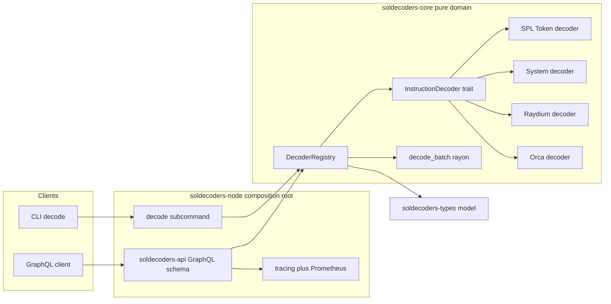
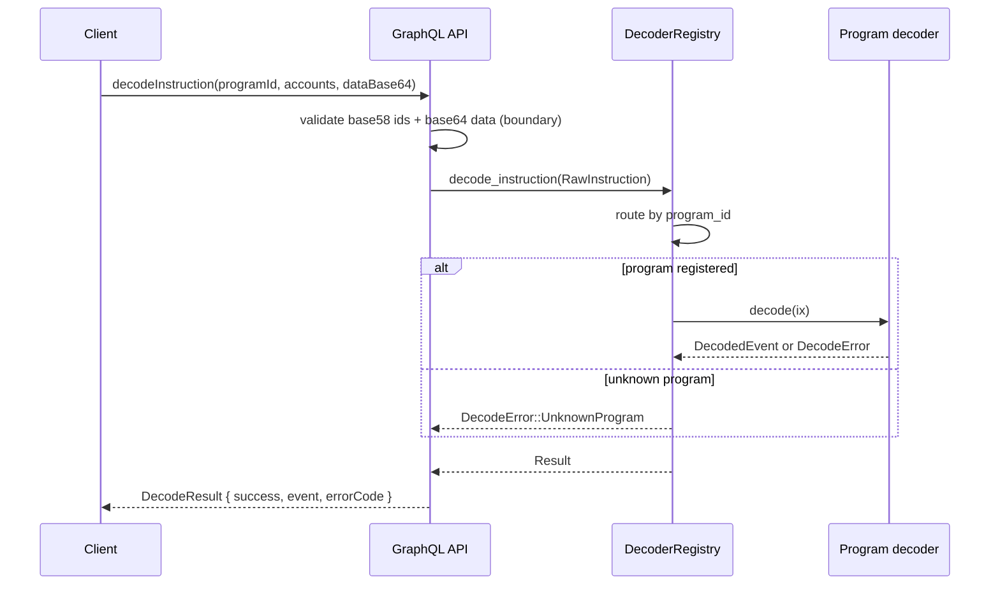

# SolDecoders

> A reusable, trait-based **Solana program-instruction decoder library** in Rust. It turns raw
> on-chain instructions (SPL Token, System, Raydium AMM v4, Orca Whirlpool) into typed,
> analytics-ready events through a pluggable registry, and serves them over a GraphQL API and CLI.

[](https://github.com/ABHIJEET-MUNESHWAR/SolDecoders/actions)

---

## Table of Contents

1. [Why SolDecoders](#why-soldecoders)
2. [Features](#features)
3. [Architecture](#architecture)
   - [Component diagram](#component-diagram)
   - [Component details](#component-details)
   - [Decode flow](#decode-flow)
4. [Crate layout](#crate-layout)
5. [Supported programs](#supported-programs)
6. [Getting started](#getting-started)
7. [GraphQL API](#graphql-api)
8. [CLI](#cli)
9. [Observability](#observability)
10. [Performance & complexity](#performance--complexity)
11. [Testing](#testing)
12. [Docker](#docker)
13. [Design guidelines mapping](#design-guidelines-mapping)

---

## Why SolDecoders

Any Solana analytics platform must first answer one question for every instruction in every block:
*what did this actually do?* SolDecoders is the **reusable decoding layer** that answers it. It is
deliberately a **library first** — the `GeyserIndex` indexer and `WalletLens` intelligence engine
consume the exact `DecodedEvent` model produced here, so decoding logic lives in exactly one place
(DRY, open/closed).

## Features

- **Pluggable registry** — add a protocol by implementing one trait (`InstructionDecoder`); no
  existing code changes (open/closed principle).
- **Typed event model** — a `serde`-serialisable `DecodedEvent` enum that flows unchanged from the
  decoder through GraphQL into downstream streaming systems.
- **Built-in decoders** — SPL Token (`Transfer`/`MintTo`/`Burn` + `*Checked`), System (`Transfer`),
  Raydium AMM v4 (`swapBaseIn`/`swapBaseOut`), Orca Whirlpool (Anchor `swap`).
- **Parallel batch decoding** — `decode_batch` fans pure CPU-bound work across the rayon pool.
- **Compile-time safety** — `Pubkey`/`Signature` newtypes validate length at construction; an
  invalid key cannot be represented downstream.
- **Robust errors** — every failure is a typed `DecodeError` with a stable machine code; routing
  misses are distinguished from corrupt input.
- **GraphQL + CLI + metrics** — one binary serves the schema, decodes from the command line, and
  exposes Prometheus metrics.

## Architecture

SolDecoders follows a **hexagonal (ports & adapters)** layout. The pure decoding domain has zero
framework dependencies; the GraphQL/CLI/metrics adapters depend inward on it.

### Component diagram



### Component details

| Component | Crate | Responsibility |
|---|---|---|
| Domain model | `soldecoders-types` | `Pubkey`/`Signature` newtypes, `RawInstruction`/`RawTransaction`, the `DecodedEvent` hierarchy, and `DecodeError`. No I/O. |
| `InstructionDecoder` | `soldecoders-core` | The open/closed seam — one trait per program. |
| `DecoderRegistry` | `soldecoders-core` | Routes a `program_id` to its decoder; builder-style registration generic over decoder type. |
| Program decoders | `soldecoders-core` | SPL Token, System, Raydium AMM v4, Orca Whirlpool byte-layout parsers. |
| `decode_batch` | `soldecoders-core` | Parallel (rayon) batch decode for high-throughput ingestion. |
| GraphQL API | `soldecoders-api` | `decodeInstruction`, `decodeTransaction`, `decodeBatch`, `supportedPrograms`. |
| Composition root | `soldecoders-node` | CLI/config, telemetry, axum server, `decode` subcommand, criterion bench. |

### Decode flow



## Crate layout

```
crates/
  soldecoders-types/   # newtypes, raw + decoded model, DecodeError
  soldecoders-core/    # InstructionDecoder trait, registry, program decoders, decode_batch
  soldecoders-api/     # async-graphql schema (queries only — decoding is pure)
  soldecoders-node/    # bin: serve + decode CLI, telemetry, bench
```

## Supported programs

| Protocol | Program id | Decoded events |
|---|---|---|
| SPL Token | `Tokenkeg…VQ5DA` | `spl_transfer`, `spl_mint`, `spl_burn` (incl. `*Checked`) |
| System | `1111…1111` | `system_transfer` |
| Raydium AMM v4 | `675k…1Mp8` | `dex_swap` (swapBaseIn/Out) |
| Orca Whirlpool | `whir…ctyCc` | `dex_swap` (Anchor `swap`) |

## Getting started

```bash
# build
cargo build --release

# run the GraphQL server (http://localhost:8080/graphql)
cargo run -p soldecoders-node -- serve

# decode one instruction from the CLI
cargo run -p soldecoders-node -- decode \
  --program-id 11111111111111111111111111111111 \
  --accounts 11111111111111111111111111111112,11111111111111111111111111111113 \
  --data-base64 AgAAAADKmjsAAAAA
```

## GraphQL API

| Operation | Type | Description |
|---|---|---|
| `apiVersion` | query | Running crate version. |
| `supportedPrograms` | query | Registered `(programId, name)` pairs. |
| `decodeInstruction(input)` | query | Decode a single instruction. |
| `decodeTransaction(input)` | query | Decode every instruction in a transaction. |
| `decodeBatch(instructions)` | query | Parallel batch decode (rayon). |

A Postman collection is provided at [`postman/SolDecoders.postman_collection.json`](postman/SolDecoders.postman_collection.json).

## CLI

`decode` builds a `RawInstruction` from base58 ids + base64 data, routes it through the built-in
registry, and prints the typed event (or a typed error) as pretty JSON.

## Observability

- **Tracing** — structured logs (`--log-json` for JSON), `RUST_LOG`-driven filtering.
- **Metrics** — Prometheus at `/metrics`; `soldecoders_graphql_requests_total` counts requests.
- **Health** — `/health/live` and `/health/ready`.

## Performance & complexity

| Operation | Time | Space | Notes |
|---|---|---|---|
| `decode_instruction` | O(1) | O(1) | hash-map route + fixed-width byte reads |
| `decode_transaction` | O(n) | O(n) | n = instructions, serial, order-preserving |
| `decode_batch` | O(n / p) | O(n) | p = rayon threads; reserve for large batches |
| `Pubkey::from_base58` | O(1) | O(1) | 32-byte bounded decode |

Run the benchmark (serial vs parallel across 1k/100k mixed instructions):

```bash
cargo bench -p soldecoders-node --bench decode_bench
```

## Testing

56 unit/integration tests cover decoders (happy path + every error edge), the registry, the parallel
batch path, the GraphQL schema, the HTTP surface, and the CLI.

```bash
cargo test --workspace
```

### Test results

| Suite | Tests |
|---|---|
| `soldecoders-types` | 25 |
| `soldecoders-core` | 16 |
| `soldecoders-api` | 5 |
| `soldecoders-node` | 10 |
| **Total** | **56 passed, 0 failed** |

<details><summary>Raw output</summary>

```
test result: ok. 25 passed; 0 failed   # soldecoders-types
test result: ok. 16 passed; 0 failed   # soldecoders-core
test result: ok.  5 passed; 0 failed   # soldecoders-api
test result: ok. 10 passed; 0 failed   # soldecoders-node (config/decode/startup)
```
</details>

## Docker

```bash
docker compose up --build              # API on :8080
docker compose --profile monitoring up # + Prometheus on :9090
```

## Design guidelines mapping

See [EVALUATION.md](EVALUATION.md) for a point-by-point mapping to the 29 engineering guidelines.

---

© Abhijeet Ashok Muneshwar — Apache-2.0
